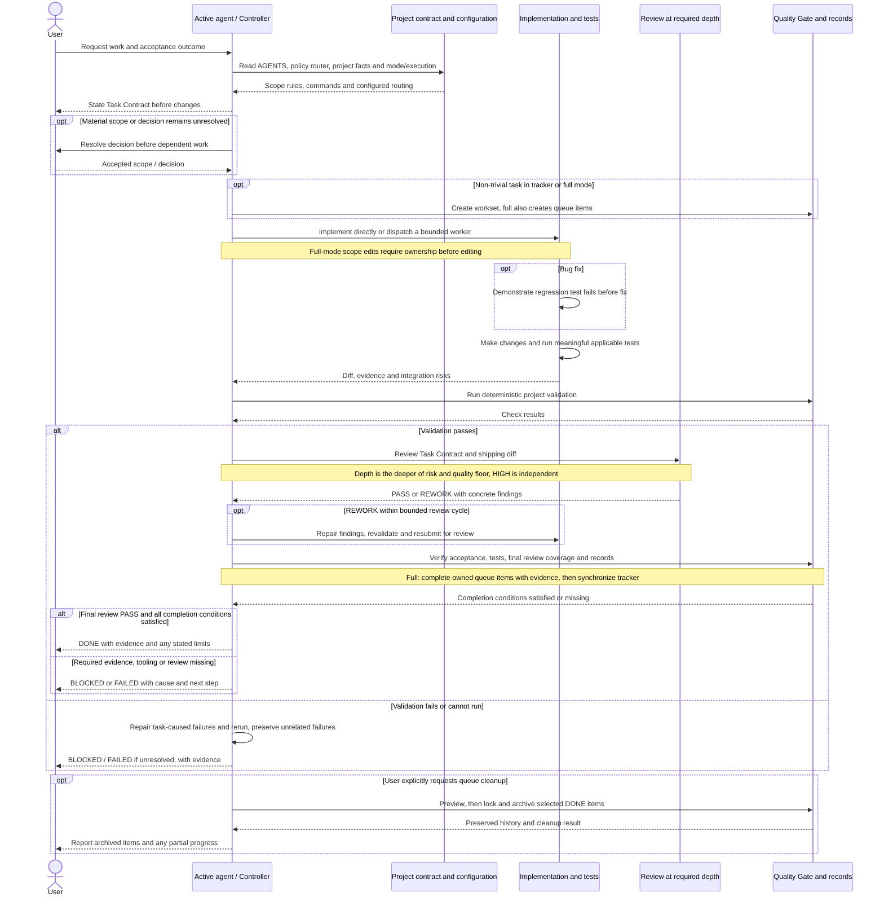
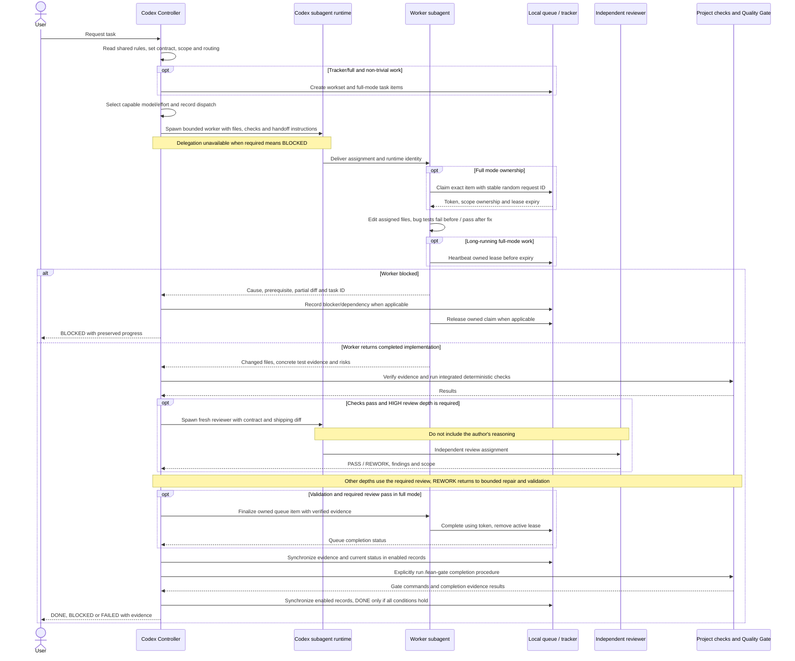
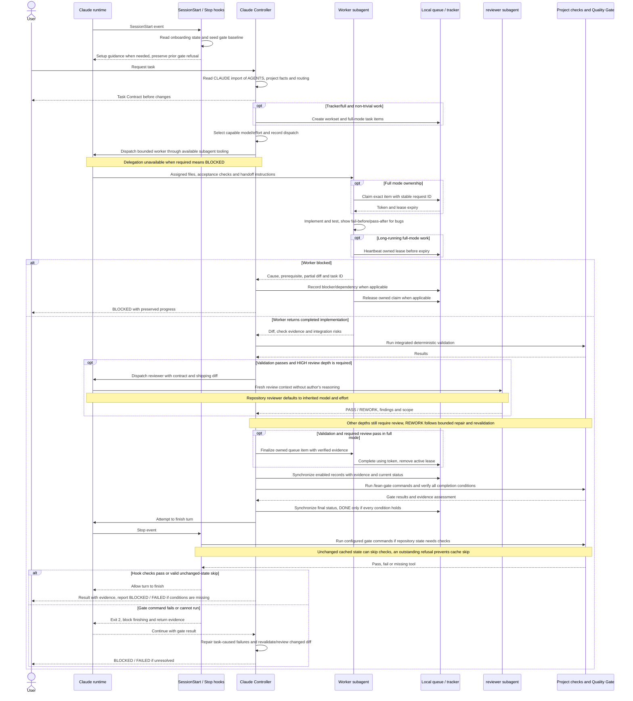
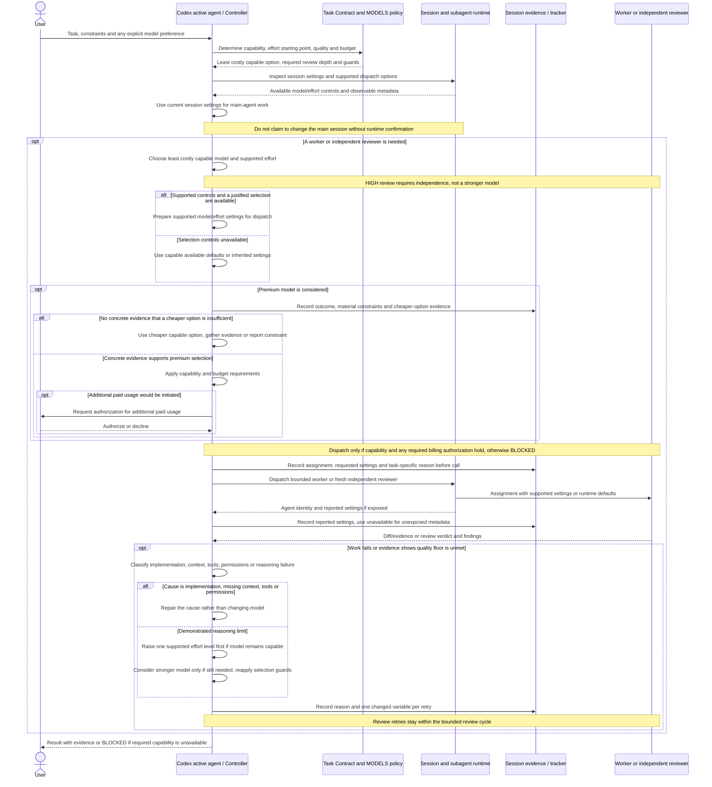
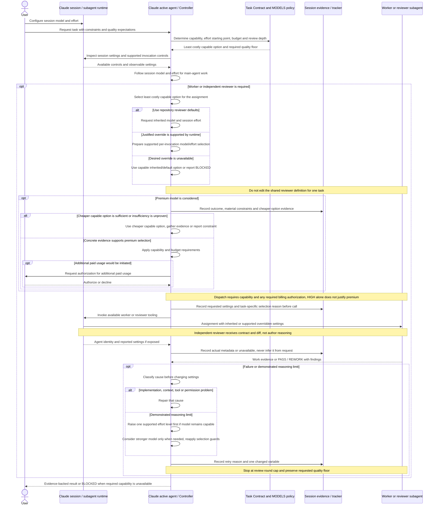

# Lean Workflow Agent by ASDW

A reusable GitHub template for working with coding agents through clear task contracts, meaningful tests, risk-based review and evidence before completion. Claude and Codex share one workflow, with optional tracking and task ownership. Bring your own application stack and choose how much process your project needs.

Current baseline: **3.3.0**. The template starts with unconfigured `standard` mode and `direct` execution; it contains no project tasks, queue items or leases.

## Workflow modes

| Mode | How work is managed | Useful when |
|---|---|---|
| `standard` | Task Contract → work → tests → validation → review → Quality Gate. Evidence stays in the session. | You want the core workflow with minimal record keeping. |
| `tracker` | Everything in standard, plus one workset document for each non-trivial task under `docs/tracking/`. | Decisions, progress and evidence need to survive between sessions. |
| `full` | Everything in tracker, plus queue items, scope ownership and local lease claims. | Multiple workers need explicit task ownership in one checkout. |

All three modes retain the same testing rules, quality floor and review requirements. A heavier mode adds coordination; it does not select a stronger model or a different quality level. Trivial tasks need no new tracker or queue item; work within an already claimed scope still follows ownership rules.

Execution is a separate choice:

| Execution | Who does the work |
|---|---|
| `direct` | The active agent implements and coordinates the task. This is the default. |
| `delegated` | The active agent acts as Controller and dispatches bounded work to a capable worker. |

Delegated execution requires available worker tooling. Parallel workers additionally require explicit user intent, independent tasks and exclusive file ownership. Independent HIGH-depth review is required with either execution setting.

## Sequence diagrams

These diagrams describe the workflow, not an automatic scheduler. The active agent owns the task; it becomes the Controller when delegating. Modes add records independently of execution and review depth. A worker is used when execution is `delegated` or workers are explicitly requested. HIGH-depth review needs a fresh independent reviewer even in `direct` execution.

### Level 0: complete workflow



A PASS ends its review cycle. After the second REWORK, only one final repair/review pass is allowed; another REWORK reports BLOCKED. Changes after PASS open a new contract. Commit, push and merge are separate actions performed when requested.

### Codex: Controller, worker and independent reviewer



Codex uses the adapters in `.agents/skills/` to follow shared procedures. Claude's hook settings do not run Codex checks. Worker completion alone never completes the workset. Concurrent workers require explicit parallel intent, independent tasks and exclusive file ownership; the diagram shows the default single worker.

### Claude: Controller, worker, reviewer and hooks



Claude's Stop hook enforces deterministic gate commands; it does not prove acceptance evidence, review independence or tracker/queue synchronization. The Controller must verify those conditions. The hook avoids recursively blocking a continuation already marked `stop_hook_active`; that guard does not authorize declaring DONE after a failed gate.

### Codex: model and reasoning-effort selection

Model selection follows [.lean/policy/MODELS.md](.lean/policy/MODELS.md), independently of repository mode. The main agent follows the session settings. For dispatches that the runtime can configure, start with an economical model / low effort for mechanical work, the current/default capable model / medium effort for normal implementation or focused review, and a capable model / useful high effort for hard reasoning. Budget guides optional spend and never lowers the quality floor.



Requested settings are not proof of backend settings. An unsupported desired setting uses a capable available option; if none meets the quality floor, report BLOCKED. Recommend a user-controlled session change only when the current settings threaten that floor or repeated reasoning failure warrants it. Do not hardcode provider model IDs or pricing into the shared policy.

### Claude: session inheritance and model selection

Claude follows the same capability, budget and premium rules. Its session model and effort come from the user's/runtime's settings. The repository's [reviewer definition](.claude/agents/reviewer.md) has `model: inherit` and inherits session effort; runtime-supported per-invocation overrides do not require editing that shared definition.



Session inheritance does not guarantee that a configured model can meet every task's quality floor. If the runtime cannot expose or change a setting, report that limitation honestly and assess the available option against the contract. Never increase spend merely because a task is long.

## Getting started

### Requirements

Use macOS, Linux or WSL with Bash, Git and Python **3.9+**. Python tooling uses only the standard library; lease locking uses Unix `fcntl`. Install ShellCheck to run the workflow's own lint gate. Native Windows is unsupported.

Your coding agent and its runtime are supplied separately. The template has no application dependencies and requires no paid service of its own; agent access and usage follow your runtime's settings.

### Start a new project

Use GitHub's **Use this template** action if the repository is enabled as a template, or clone it and change the remote for your own repository:

```sh
git clone https://github.com/aussadawut-dev/lean-workflow-agent-by-asdw.git my-project
cd my-project
```

To copy the files without this repository's Git history, an optional Node/npm-based route is:

```sh
npx degit aussadawut-dev/lean-workflow-agent-by-asdw my-project
cd my-project
git init
```

Open the project in Claude Code and run `/lean-init`, or invoke `$lean-init` in Codex. It discovers actual project facts and commands, records the selected mode/execution, and helps fill `.lean/PROJECT.md`.

Claude uses shared skills under `.claude/skills/`; Codex uses adapters under `.agents/skills/`. If your runtime does not discover skills, ask the agent to read the relevant `SKILL.md` and follow its procedure. Other agents can follow `AGENTS.md` and the shared procedures manually; runtime integrations are provided for Claude and Codex.

### Configure without an agent

Choose one mode, then inspect and validate it:

```sh
python3 .lean/scripts/workflow.py configure standard
python3 .lean/scripts/workflow.py show
python3 .lean/scripts/workflow.py check
```

To enable tracking and delegation instead:

```sh
python3 .lean/scripts/workflow.py configure tracker --execution delegated
```

Omitting `--execution` preserves the current setting. Configuration belongs to the project in `.lean/config.json`; agents follow the recorded choice rather than selecting a mode for each task.

Fill `.lean/PROJECT.md` with your application's real test, lint, build and typecheck commands. Add gate commands between its existing markers, one command per line. Each must exit non-zero on failure. The shipped commands test the workflow itself; they do not validate application code you add later.

### Work with a tracker

In tracker or full mode:

```sh
python3 .lean/scripts/workflow.py tracker new --id TCK001 --title "Implement sign-in"
```

Update the generated workset with the goal, acceptance criteria, decisions, task progress, evidence and next step. Synchronize it after material progress. Supported statuses are `PLANNED`, `IN_PROGRESS`, `VALIDATING`, `REVIEWING`, `DONE`, `BLOCKED` and `FAILED`.

The CLI requires evidence and checked acceptance/task lists before setting `DONE`. In full mode, all linked queue items must also be DONE. Only record completion after the actual Quality Gate and required review pass.

### Claim work in full mode

Configure full mode, create a tracker, and create queue items from `.lean/templates/queue-item.json` under `.agents/queue/items/`. Each item needs a unique `QNNNN` ID, a valid tracker ID, dependencies and exclusive scope labels.

```sh
python3 .lean/scripts/workflow.py configure full
python3 .lean/scripts/workflow.py queue list
python3 .lean/scripts/workflow.py queue claim --id Q0001 --agent worker-a --request-id RANDOM-UNIQUE-ID
```

Replace `RANDOM-UNIQUE-ID` with a new random identifier of at least eight characters, such as a UUID. Keep it until you receive the claim receipt. If the response is lost, retry with the same agent, item and request ID to recover the same token. `claim-next` can select an eligible item when a particular ID has not been assigned.

The claim returns a token. Use it to renew or release ownership:

```sh
python3 .lean/scripts/workflow.py queue heartbeat --id Q0001 --token 'TOKEN-FROM-RECEIPT'
python3 .lean/scripts/workflow.py queue release --id Q0001 --token 'TOKEN-FROM-RECEIPT'
```

A lease lasts 30 minutes; renew it during long work. Use `queue complete --id Q0001 --token 'TOKEN-FROM-RECEIPT' --evidence 'ACTUAL-VALIDATION-EVIDENCE'` only after validation and required review. Completion rechecks dependencies and requires nonblank evidence; it cannot establish that an arbitrary evidence string is true. Synchronize the tracker after queue completion.

### Keep workflow prose lean and clear

Use `/lean-compress` to remove repetition and filler while preserving the same rules and practical meaning. The [shared procedure](.claude/skills/lean-compress/SKILL.md) works for Claude and through the Codex adapter. It uses clear, concise language and has no fixed compression ratio.

```text
/lean-compress workflow --preview
/lean-compress README.md --preview
/lean-compress README.md --apply
```

Preview is the default. `workflow` targets editable workflow prose; paths restrict which prose files may change. `--apply` requests changes within an approved scope. A matching approval is reused; a new scope or change to workflow behavior needs resolution before dependent edits. Reading a file never authorizes rewriting it.

**Read every corner of the workflow before compressing.** Inventory and fully read the canonical contract, router/policies, project facts, all skills/resources/adapters, reviewer, hooks/settings, scripts/tests/templates, CI, README and history/ownership guidance. Record each file and revision in a coverage ledger. Large files must be read through EOF in chunks; listings, grep snippets, hashes and summaries do not establish coverage. An unread or inaccessible in-scope file blocks dependent compression. Exclude credentials, private settings, caches and runtime internals; report exclusions rather than claiming they were reviewed.

Then map the original rules to the proposed wording: actor, trigger, prerequisites, action, ordering, limits, exceptions, evidence and failure behavior. Keep frontmatter, imports, headings/anchors, code/Mermaid, inline code, commands, links, paths, identifiers, numeric limits, versions, gate markers and license notices unchanged. Code, tests, configuration and project history are read for context and stay outside prose compression. Preserve accepted project additions and unrelated pending edits.

Run preservation checks and the project Quality Gate, then review the actual diff at the required depth. Independent review is required for HIGH-risk areas; tests alone cannot prove preserved meaning. Report measured byte/word changes and any unread/unchanged targets. Do not claim token savings without measurement. This complete-read requirement applies to the compression audit, rather than changing context routing for ordinary tasks. The command does not publish changes or call a paid model API.

### Refresh model research without switching models

Use `/lean-model-update codex`, `/lean-model-update claude` or `/lean-model-update all` to follow scope → research → grill → preview. The shared skill checks official docs and exposed runtime choices. Its default result is a diff and proposal hash. It applies only an explicitly authorized proposal, then follows the task/review/gate workflow. It never changes session models, global configuration, billing permissions or the reviewer’s `inherit` setting.

The optional `.lean/model-catalog.json` stores project-owned model/alias IDs, runtime version, efforts, lifecycle, source URLs/dates and observed availability. Public documentation alone means availability is unknown. Selected evidence older than 30 days blocks preview/apply; retained providers remain visible as stale. Missing catalog leaves normal model selection unchanged. The template ships no live catalog.

The offline CLI consumes researched JSON candidates; it does not fetch models or perform inference. Read the [catalog format](.claude/skills/lean-model-update/references/catalog.md) before preparing a candidate. A provider refresh replaces that provider's complete model list, so review removals and aliases in the diff.

```sh
python3 .lean/scripts/model_catalog.py check
python3 .lean/scripts/model_catalog.py preview --provider codex --candidate /path/to/candidate.json
# Save the preview JSON report, review it, then apply only after authorization:
python3 .lean/scripts/model_catalog.py apply --proposal /path/to/report.json --sha256 APPROVED_PROPOSAL_DIGEST
```

Preview/check write nothing. Apply rechecks the base and evidence under a lock, preserves other providers and custom catalog fields, and writes the catalog atomically. It also creates/retains an ignored `.agent-runtime/model-catalog.lock`, including when a locked apply is refused; it never modifies runtime model settings. A changed base requires a new preview; an identical retry leaves the catalog unchanged. The proposal digest checks content consistency, not the authenticity of research. CLI failures exit 2 and do not claim a refresh succeeded. Tests use synthetic fixtures without network or paid model calls.

### Clean completed queue items

Use either command in your coding agent:

```text
/clean-queue old
/clean-queue all
```

| Command | DONE items selected | Items retained |
|---|---|---|
| `/clean-queue old` | Completed strictly more than 30 days ago, using `completed_at`. | DONE from the last 30 days, undated DONE, and all READY/BLOCKED items. |
| `/clean-queue all` | Every DONE item, including undated legacy items. | All READY/BLOCKED items. |

Both commands archive queue items only; trackers stay in place. “All” means all DONE items,
not all work. Cleanup moves records out of the active queue and keeps their full history.
The skill previews the selection, then applies the explicitly requested cleanup without asking
for the same permission again. If slash-command discovery is unavailable, follow the shared
[clean-queue procedure](.claude/skills/clean-queue/SKILL.md) or use the CLI below.

Equivalent CLI commands (choose old or all):

```sh
python3 .lean/scripts/workflow.py clean-queue old --dry-run
python3 .lean/scripts/workflow.py clean-queue old --apply
python3 .lean/scripts/workflow.py clean-queue all --dry-run
python3 .lean/scripts/workflow.py clean-queue all --apply
python3 .lean/scripts/workflow.py queue history
python3 .lean/scripts/workflow.py queue history --id Q0001
```

New completions record a UTC `completed_at`. Old skips/reports legacy DONE items without that field;
all can archive them. Exactly 30 days old is retained by old; it becomes eligible only after that
threshold. File modification time is never used to invent a completion date.

History under `.agents/queue/history/` retains original JSON bytes, custom fields, evidence, IDs,
checksum, archive time and selection without automatic expiry. Commit this project history when
saving the cleanup; it is not template material. Dependencies and tracker checks resolve archived
DONE items, while the active queue list and claims exclude them. History can be read after lowering
the project mode. `queue history` lists archived IDs/titles; `queue history --id Q0001` returns
the full snapshot, including original JSON in its `content` field. A checksum detects content
mismatch; it is not proof of authentic evidence.

Preview writes nothing; apply uses the shared lock and rechecks data. Live claims on DONE records
and malformed data block cleanup. Valid live claims on retained READY items are preserved and do
not block it. Each snapshot is written/synced before deleting its source. A process
interruption can leave an identical source copy; it is already logically archived, and retrying
cleanup finishes the removal. Batches are recoverable per item, not all-or-nothing; report any
partial progress after an error. Do not reuse archived IDs, manually delete prerequisites, or run
cleanup alongside workers using older tooling. Neither the CLI nor skill commits/pushes automatically.

### Upgrade or downgrade modes

Upgrades use `configure` and preserve records:

```sh
python3 .lean/scripts/workflow.py configure tracker
python3 .lean/scripts/workflow.py configure full
```

To lower a mode, preview first, then apply explicitly. For example, from full to tracker:

```sh
python3 .lean/scripts/workflow.py downgrade tracker --dry-run
python3 .lean/scripts/workflow.py downgrade tracker --apply --keep-pending
```

Supported routes are **full → tracker**, **tracker → standard**, and **full → standard**. `configure` continues to refuse implicit downgrades.

- Preview writes nothing and reports counts, pending IDs, active/expired claims and blockers as JSON. Exit code 2 means blocked or refused, including invalid data or a missing acknowledgment.
- Active claims block every downgrade. Complete or release them through the owning worker. Moving to standard also requires resolving trackers in IN_PROGRESS, VALIDATING or REVIEWING.
- `--keep-pending` explicitly acknowledges preserved, paused queue work and, for standard, PLANNED/BLOCKED/FAILED trackers. It cannot bypass active-work or validation guards. Omit it when there is no pending work.
- Apply takes the shared lock, rechecks current state and atomically updates config. Tracker/queue records, IDs, evidence, expired lease files, execution settings and custom config fields stay intact.
- Lower modes stop requiring the disabled layer. Queue commands require full; tracker commands require tracker/full. Retained records are not deleted or automatically marked DONE.

Upgrading back validates retained records before enabling the higher mode. If a tracker was marked DONE while its queue was paused and remains unfinished, reopen the tracker in tracker mode before returning to full. Do not invent completion evidence to pass a transition.

Without an existing lock, preview is an advisory snapshot; apply always locks and rechecks. Stop workers using older tooling before upgrading, and avoid concurrent manual edits to config/records.

## Capabilities in detail

### One shared contract across agents

[AGENTS.md](AGENTS.md) is canonical. [CLAUDE.md](CLAUDE.md) imports it, and eleven Codex adapters reference the same shared skill procedures. No provider is the required primary agent; the active agent owns the task unless the project records a different Controller.

The contract requires acceptance evidence before reporting DONE, preserves an explicitly requested quality floor, and limits extra effort to work with a useful reason. Project-specific additions have dedicated sections so upgrades can preserve them.

### Planning, scope and decisions

A one-line Task Contract identifies risk, quality and observable acceptance before changes begin. The workflow supports reusing accepted scope, gathering evidence for alternatives and resolving material decisions before dependent implementation. Routine work within accepted scope needs no repeated approval.

Agents start with the smallest sufficient context. The policy router points them to deeper rules only when needed, and `.lean/PROJECT.md` supplies actual repository facts rather than an imposed stack or architecture.

### Meaningful tests and risk-based review

Behavior changes require meaningful tests. Bug fixes require a regression test demonstrated failing before the fix and passing afterward. Deterministic validation runs before semantic review.

Review depth follows the deeper of task risk and quality floor. HIGH-depth review requires an independent reviewer receiving the Task Contract and shipping diff without the author's reasoning. The review loop is bounded: after a second REWORK, one final pass must resolve the findings or report BLOCKED. A PASS ends that review cycle.

### Quality Gates and honest completion

Project-owned gate commands live in [.lean/PROJECT.md](.lean/PROJECT.md). Claude's Stop hook runs them; Codex follows the shared procedures and runs them explicitly.

The Claude gate tracks repository state to avoid repeating checks on unchanged work. Committed changes are still gated, and a prior failure is not cleared by merely seeding the cache. A missing tool and a real command failure both block completion, with different messages so an environment problem is not mistaken for an application defect.

Pre-existing or out-of-scope failures are reported with evidence rather than repaired merely to satisfy hook pressure. An unavailable required reviewer or worker also results in BLOCKED.

### Durable tracking and local ownership

Trackers retain acceptance criteria, decisions, status and evidence across sessions. Queue items link work to trackers and declare dependencies and exclusive scopes. The CLI validates IDs, supported states, dependency cycles, completion evidence and tracker–queue consistency where the active mode requires it.

Local lease tooling supports exact-item claims, eligible-item selection, heartbeat, release, completion and retry recovery. It refuses overlapping exact scope labels, multiple live claims for one agent and unfinished dependencies at completion. Configure, downgrade and worker operations use the same lock; workers check the current mode after acquiring it.

Scope labels are compared exactly: a directory label does not automatically cover all descendant file labels. Ownership is coordinated in **one checkout**, not across machines or Git worktrees. Tokens are coordination receipts, not a security boundary, and expired leases do not forcibly stop a worker process.

### Model and effort discipline

Portable policy chooses the least costly available model and supported effort capable of satisfying the task. It does not pin provider model IDs or volatile pricing. Risk, quality, repository mode, execution strategy and model choice remain separate.

Premium dispatch requires concrete evidence that a cheaper available option cannot satisfy the task; additional paid usage still needs user authorization. Agents record requested and reported settings honestly and cannot claim a runtime change that was not confirmed.

### Five commands for users

Start ordinary work with `lean-task`; the agent handles scope, research, material decisions, implementation, review and completion checks as needed. It asks for unresolved material decisions or new scope approval, and preserves accepted decisions. You do not need to run each internal step yourself.

| Purpose | Claude Code | Codex skill invocation |
|---|---|---|
| Set up mode and execution | `/lean-init [standard\|tracker\|full] [--execution direct\|delegated]` | `$lean-init` with the same arguments |
| Start a task | `/lean-task <task description>` | `$lean-task <task description>` |
| Research a model catalog refresh | `/lean-model-update [codex\|claude\|all]` | `$lean-model-update` with the same arguments |
| Audit and shorten workflow prose | `/lean-compress [workflow\|PATH...] [--preview\|--apply]` | `$lean-compress` with the same arguments |
| Archive completed queue items | `/clean-queue <old\|all> [--preview]` | `$clean-queue` with the same arguments |

For example:

```text
# Claude Code
/lean-task Add a regression test and fix the queue lease bug
/lean-compress workflow --preview
/clean-queue old --preview

# Codex
$lean-task Add a regression test and fix the queue lease bug
$lean-compress workflow --preview
$clean-queue old --preview
```

Claude Code exposes these five skills as slash commands. Six internal procedures (`lean-scope`, `lean-research`, `lean-grill`, `lean-review`, `lean-gate`, `lean-multi-agent`) use `user-invocable: false`: hidden from its slash menu, but available for the agent to invoke. They remain shared procedures with Codex adapters.

In Codex CLI/IDE, select skills through `/skills` or mention them with `$`; use the available skill picker in Desktop. Codex has no documented equivalent of Claude's `user-invocable: false` for hiding only manual invocation, so internal adapters remain discoverable and are labeled as internal. Do not disable their implicit invocation: the agent needs them. Examples elsewhere using `/name` describe Claude syntax; use the corresponding Codex skill invocation. No deprecated custom prompts or global installation are required. See [Claude skill invocation](https://code.claude.com/docs/en/skills) and [Codex skill invocation](https://learn.chatgpt.com/docs/build-skills).

Model refresh and compression still preview by default; applying a catalog proposal or compression requires its existing authorization checks. Queue cleanup with `old` or `all` authorizes archiving DONE items; `--preview` only shows the selection. Missing queue selection requires a choice. Command visibility grants no extra permissions, paid usage or Git publishing.

### Runtime integration and limits

Claude's `.claude/settings.json` supplies SessionStart and Stop hooks, read-only Git permissions and `.env` read denies. These settings are Claude-specific; they do not configure Codex hooks or permissions and are not a general secret-protection guarantee. Keep secrets out of trackers, queue items and dispatch messages.

For headless Claude, follow your runtime's workspace trust and tool permission requirements. Other agents can follow the shared contract, but this repository does not provide native adapters for every runtime.

Workflow self-tests run locally and in GitHub Actions on Ubuntu with Python 3.9. They cover onboarding, modes, lease ownership, evidence/dependencies, downgrade guards, dry-run preservation, worker races, upgrade-back validation, canonical routing and adapter parity. Smoke tests isolate reusable assets and preserve a configured host's project license and records. CI validates the workflow; add your application's own checks separately.

## Repository layout

```text
AGENTS.md                  Shared contract and project additions
CLAUDE.md                  Claude entrypoint importing the contract
.lean/
  PROJECT.md               Project-owned facts, commands and gate
  config.json              Project-owned mode and execution choice
  README.md                Policy router
  CUSTOMIZING.md           Import, ownership and upgrade guidance
  LICENSE                  Workflow notice for downstream imports
  CHANGELOG.md             Versions and migrations
  policy/                  Portable workflow rules
  templates/               Generic tracker and queue templates
  scripts/                 Mode/lease tooling and structure checks
  tests/                   Workflow behavior and regression tests
.claude/                   Shared skills, Claude hooks/settings/reviewer
.agents/skills/            Eleven Codex adapters
.github/                   Workflow CI and PR Result Contract template
```

Tracking and queue record directories are created by their mode setup; no example task history or runtime leases ship with the template.

## Importing, customizing and upgrading

For an existing project, follow [.lean/CUSTOMIZING.md](.lean/CUSTOMIZING.md). Merge entrypoints, settings, gitignore and CI. Preserve your project's owner, facts, accepted scope, configured mode/execution, gates, records, custom agents and skills.

Put shared project overrides below `## Project additions` in `AGENTS.md`; keep Claude-specific additions in `CLAUDE.md`. Retain [.lean/LICENSE](.lean/LICENSE) for the copied workflow alongside your own project license. Read [.lean/CHANGELOG.md](.lean/CHANGELOG.md) before crossing versions, especially the 2.x migration to shared AGENTS authority.

This README and CONTRIBUTING describe the template and may be replaced downstream. Workflow self-tests/CI can be removed if no longer wanted; remove their gate commands too. Keep mode tooling when tracker/full is used and retain a functioning application gate.

## Verify the workflow

Run from a Git working tree:

```sh
shellcheck .claude/hooks/*.sh .lean/scripts/*.sh .lean/tests/*.sh
.lean/scripts/check-structure.sh
.lean/tests/test-hooks.sh
python3 .lean/scripts/workflow.py check
python3 .lean/scripts/model_catalog.py check
python3 -m unittest discover -s .lean/tests -p 'test_*.py'
```

For contribution expectations, see [CONTRIBUTING.md](CONTRIBUTING.md). The project is distributed under the [MIT License](LICENSE); preserve its notice when redistributing the workflow.
