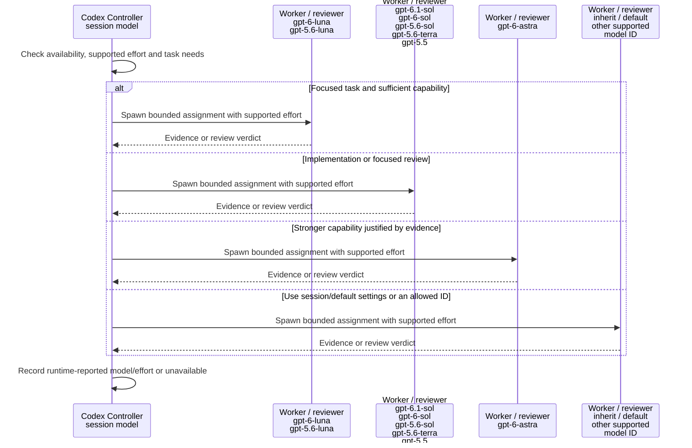
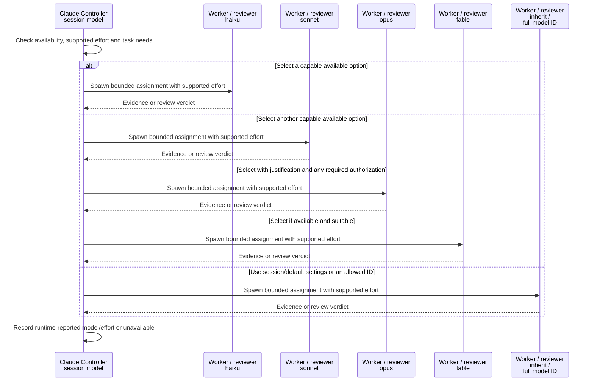
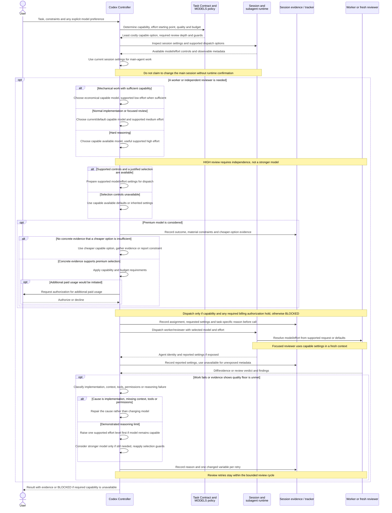
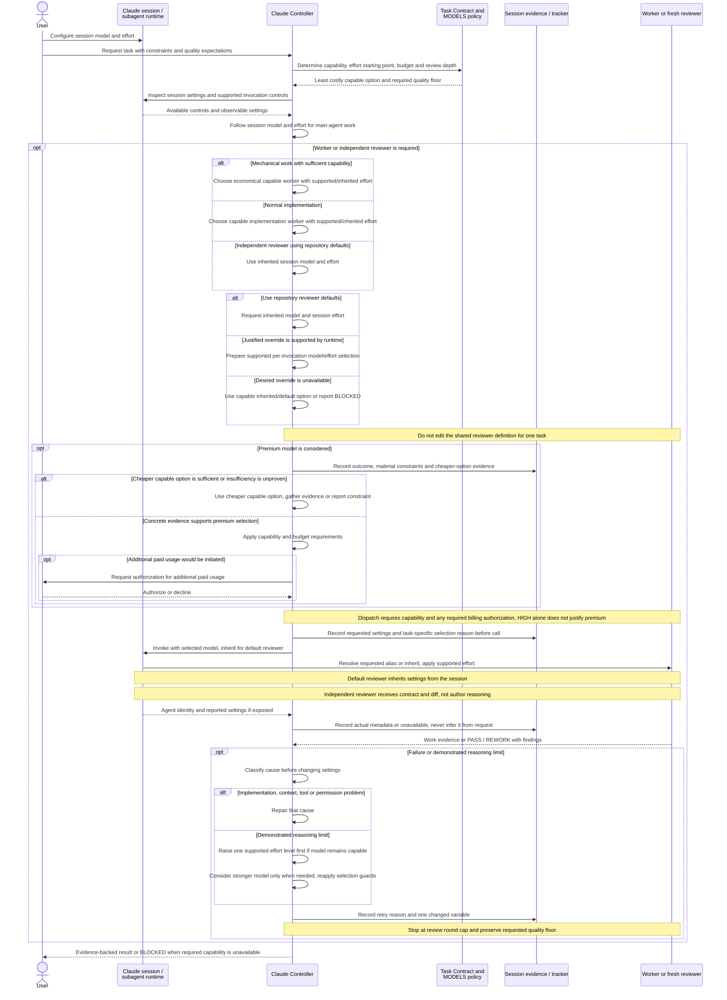

# Model and effort selection

[Back to README](../README.md)

Run CLI examples from the repository root.

## Overview

Choose a model that can handle the assignment, use supported effort, and check what the runtime actually started. The main agent keeps its session settings. All documented named options are listed below; selection examples are not fixed defaults.

### Documented model options

Snapshot checked on **2026-10-06**. These are all named options in the cited Codex model page and Claude subagent model section, rather than a fixed runtime allowlist. Availability depends on the account, client and runtime. Custom providers can expose additional IDs.

| Provider | Named options | Other selection forms |
|---|---|---|
| Codex | `gpt-6.1-sol`, `gpt-6-sol`, `gpt-6-luna`, `gpt-6-astra` | Inherited/default settings or another runtime-supported ID |
| Codex, earlier options | `gpt-5.6-sol`, `gpt-5.6-terra`, `gpt-5.6-luna`, `gpt-5.5` | `gpt-5.5` retires from Codex with ChatGPT sign-in on 2026-10-14 |
| Claude aliases | `haiku`, `sonnet`, `opus`, `fable` | `inherit` or an allowed full model ID, e.g. `claude-opus-5-5`, `claude-sonnet-5` |

Sources: [Codex models](https://learn.chatgpt.com/docs/models), [Codex subagent settings](https://learn.chatgpt.com/docs/agent-configuration/subagents), [Claude model selection](https://code.claude.com/docs/en/sub-agents#choose-a-model). Retired Codex sign-in models are excluded from current choices; API-key/provider availability must be checked separately.

### Codex



### Claude



Each model lane is an alternative, not a concurrent agent. A fresh reviewer can use the same model as the worker. Hard reasoning, premium selection, unavailable settings and retry rules are covered in the detailed sequences below; the quality floor and any required billing authorization still apply.

## Detailed sequences

## Reading the model examples

The sequences show illustrative settings, not fixed assignments or confirmed backend values. Examples were checked on 2026-10-06. Recheck availability and supported effort in your runtime before dispatch.

| Role | Codex example | Claude example |
|---|---|---|
| Controller | Session `gpt-6.1-sol`, effort `medium` | Session `sonnet`, session effort |
| Mechanical worker | `gpt-6-luna`, supported `low` effort when sufficient | `haiku`, inherited session effort when sufficient |
| Implementation worker | `gpt-6.1-sol`, effort `medium` | `sonnet`, inherited session effort |
| Independent focused reviewer | Fresh `gpt-6.1-sol`, effort `medium` | `model: inherit` → session `sonnet`, session effort |

These examples apply the repository's capability/effort starting points. A model name alone does not establish suitability or price. Premium selection still needs task-specific evidence and any required billing authorization. Model controls and inheritance are described in the official [Codex subagent documentation](https://learn.chatgpt.com/docs/agent-configuration/subagents) and [Claude subagent documentation](https://code.claude.com/docs/en/sub-agents#choose-a-model).

<details>
<summary>Codex: detailed sequence</summary>

## Codex: model and reasoning-effort selection

Model selection follows [.lean/policy/MODELS.md](../.lean/policy/MODELS.md), independently of repository mode. The main agent follows the session settings. For dispatches that the runtime can configure, start with an economical model / low effort for mechanical work, the current/default capable model / medium effort for normal implementation or focused review, and a capable model / useful high effort for hard reasoning. Budget guides optional spend and never lowers the quality floor.



Requested settings are not proof of backend settings. An unsupported desired setting uses a capable available option; if none meets the quality floor, report BLOCKED. Recommend a user-controlled session change only when the current settings threaten that floor or repeated reasoning failure warrants it. Do not hardcode provider model IDs or pricing into the shared policy.

</details>

<details>
<summary>Claude: detailed sequence</summary>

## Claude: session inheritance and model selection

Claude follows the same capability, budget and premium rules. Its session model and effort come from the user's/runtime's settings. The repository's [reviewer definition](../.claude/agents/reviewer.md) has `model: inherit` and inherits session effort; runtime-supported per-invocation overrides do not require editing that shared definition.



Session inheritance does not guarantee that a configured model can meet every task's quality floor. If the runtime cannot expose or change a setting, report that limitation honestly and assess the available option against the contract. Never increase spend merely because a task is long.

</details>

## Refresh model research without switching models

Use `/lean-model-update codex`, `/lean-model-update claude` or `/lean-model-update all` to follow scope → research → grill → preview. The shared skill checks official docs and exposed runtime choices. Its default result is a diff and proposal hash. It applies only an explicitly authorized proposal, then follows the task/review/gate workflow. It never changes session models, global configuration, billing permissions or the reviewer’s `inherit` setting.

The optional `.lean/model-catalog.json` stores project-owned model/alias IDs, runtime version, efforts, lifecycle, source URLs/dates and observed availability. Public documentation alone means availability is unknown. Selected evidence older than 30 days blocks preview/apply; retained providers remain visible as stale. Missing catalog leaves normal model selection unchanged. The template ships no live catalog.

The offline CLI consumes researched JSON candidates; it does not fetch models or perform inference. Read the [catalog format](../.claude/skills/lean-model-update/references/catalog.md) before preparing a candidate. A provider refresh replaces that provider's complete model list, so review removals and aliases in the diff.

```sh
python3 .lean/scripts/model_catalog.py check
python3 .lean/scripts/model_catalog.py preview --provider codex --candidate /path/to/candidate.json
# Save the preview JSON report, review it, then apply only after authorization:
python3 .lean/scripts/model_catalog.py apply --proposal /path/to/report.json --sha256 APPROVED_PROPOSAL_DIGEST
```

Preview/check write nothing. Apply rechecks the base and evidence under a lock, preserves other providers and custom catalog fields, and writes the catalog atomically. It also creates/retains an ignored `.agent-runtime/model-catalog.lock`, including when a locked apply is refused; it never modifies runtime model settings. A changed base requires a new preview; an identical retry leaves the catalog unchanged. The proposal digest checks content consistency, not the authenticity of research. CLI failures exit 2 and do not claim a refresh succeeded. Tests use synthetic fixtures without network or paid model calls.

## Model and effort discipline

Portable policy chooses the least costly available model and supported effort capable of satisfying the task. It does not pin provider model IDs or volatile pricing. Risk, quality, repository mode, execution strategy and model choice remain separate.

Premium dispatch requires concrete evidence that a cheaper available option cannot satisfy the task; additional paid usage still needs user authorization. Agents record requested and reported settings honestly and cannot claim a runtime change that was not confirmed.
