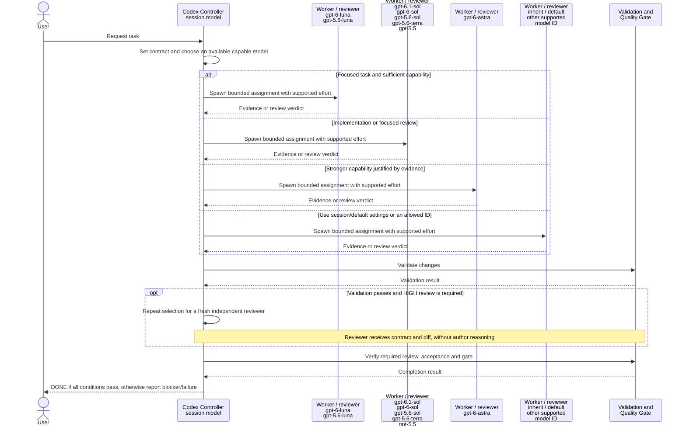
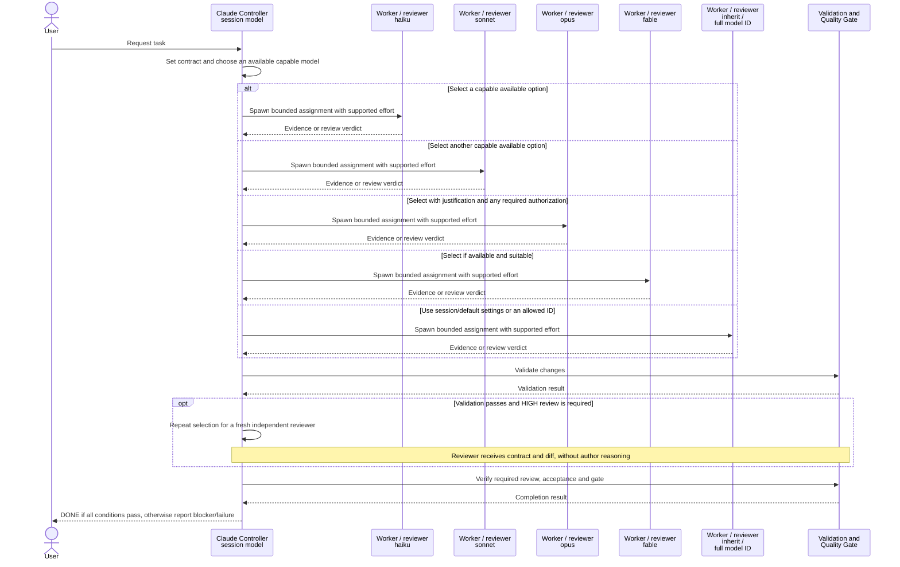
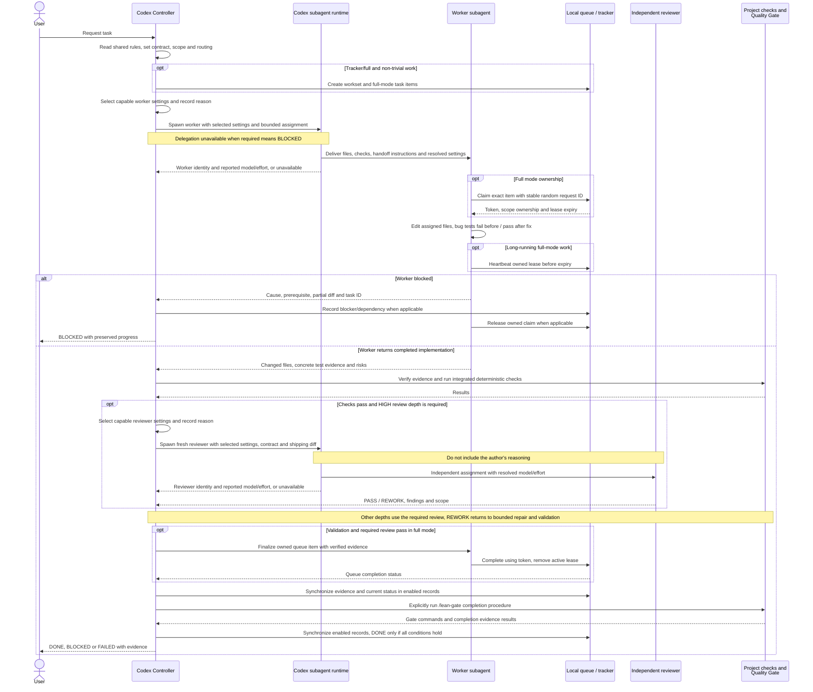
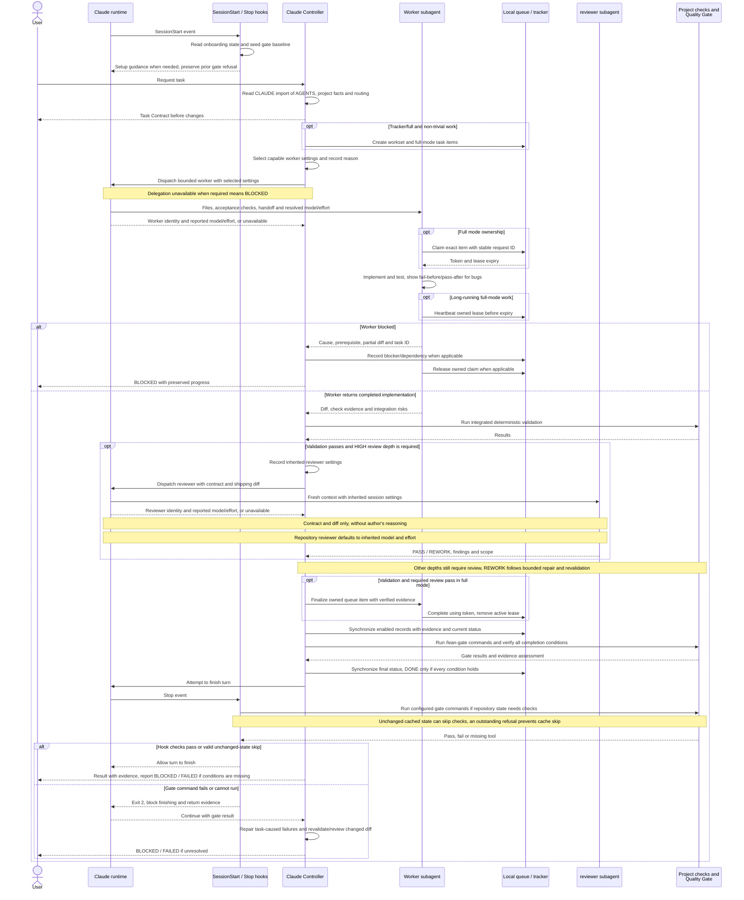

# Spawn and delegation

[Back to README](../README.md)

Run CLI examples from the repository root.

## Overview

The Controller chooses a model, assigns a bounded worker, validates the result, and completes the required review and Quality Gate. The examples show delegated work; direct execution follows the same checks with the Controller doing the implementation.

Model options below match the [documented model list](models.md#documented-model-options), checked on 2026-10-06. Select an available capable option; premium choices still require evidence and any required billing authorization.

### Codex

### Claude

Review is required at every depth; HIGH uses an independent reviewer. REWORK returns to repair and validation within the review limit. Each model lane is an alternative for one worker or fresh reviewer, not a request to spawn every model. Runtime-reported settings must be checked. Queue, lease, hook and failure-handling steps appear below.

## Detailed sequences

Execution is independent of mode: `direct` uses the active agent; `delegated` makes it the Controller with a bounded worker. Parallel workers require explicit user intent, independent tasks and exclusive file ownership. HIGH-depth review requires a fresh independent reviewer with either execution setting. See [model and effort selection](models.md) for dispatch settings.

Detailed diagrams focus on roles, ownership, validation and runtime control. Named model options appear in the overview lanes; select from available models under the [model policy](../.lean/policy/MODELS.md). Record requested and reported settings separately.

See the official [Codex subagent settings](https://learn.chatgpt.com/docs/agent-configuration/subagents) and [Claude subagent model selection](https://code.claude.com/docs/en/sub-agents#choose-a-model).

Codex: detailed sequence

## Codex: Controller, worker and independent reviewer

Codex uses the adapters in `.agents/skills/` to follow shared procedures. Claude's hook settings do not run Codex checks. Worker completion alone never completes the workset. Concurrent workers require explicit parallel intent, independent tasks and exclusive file ownership; the diagram shows the default single worker.

Claude: detailed sequence

## Claude: Controller, worker, reviewer and hooks

Claude's Stop hook enforces deterministic gate commands; it does not prove acceptance evidence, review independence or tracker/queue synchronization. The Controller must verify those conditions. The hook avoids recursively blocking a continuation already marked `stop_hook_active`; that guard does not authorize declaring DONE after a failed gate.

