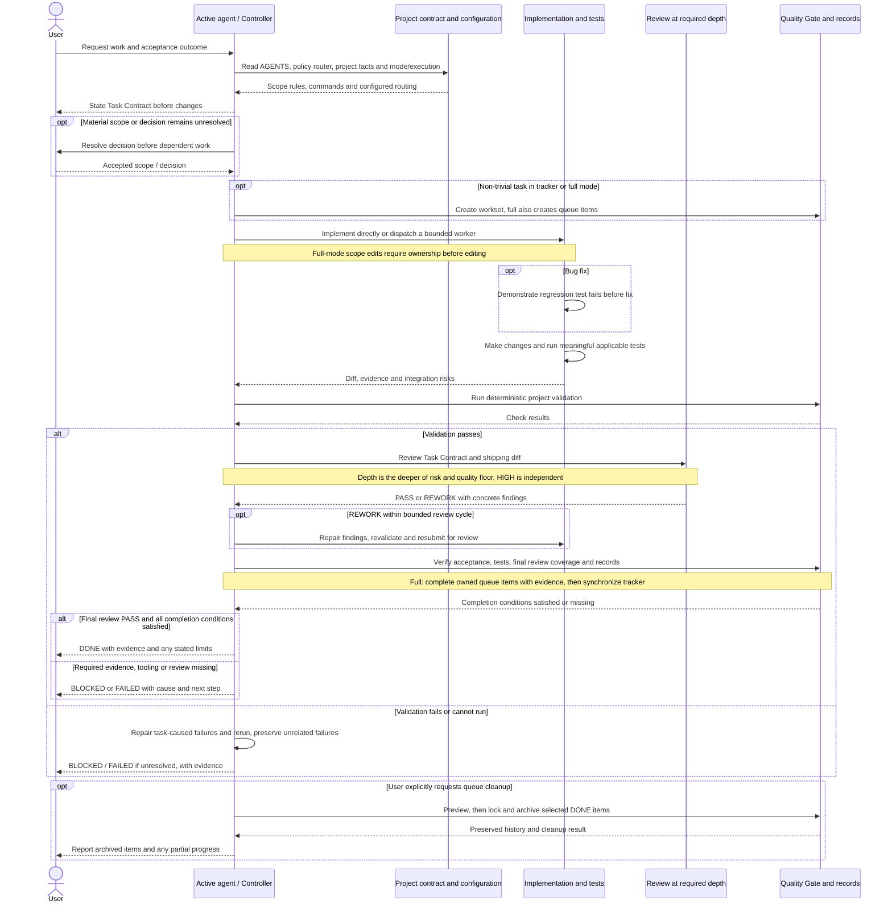

# Workflow overview

[Back to README](../README.md)

Run CLI examples from the repository root.

These diagrams describe the workflow, not an automatic scheduler. The active agent owns the task; it becomes the Controller when delegating. Modes add records independently of execution and review depth. A worker is used when execution is `delegated` or workers are explicitly requested. HIGH-depth review needs a fresh independent reviewer even in `direct` execution.

## Level 0: complete workflow

A PASS ends its review cycle. After the second REWORK, only one final repair/review pass is allowed; another REWORK reports BLOCKED. Changes after PASS open a new contract. Commit, push and merge are separate actions performed when requested.
